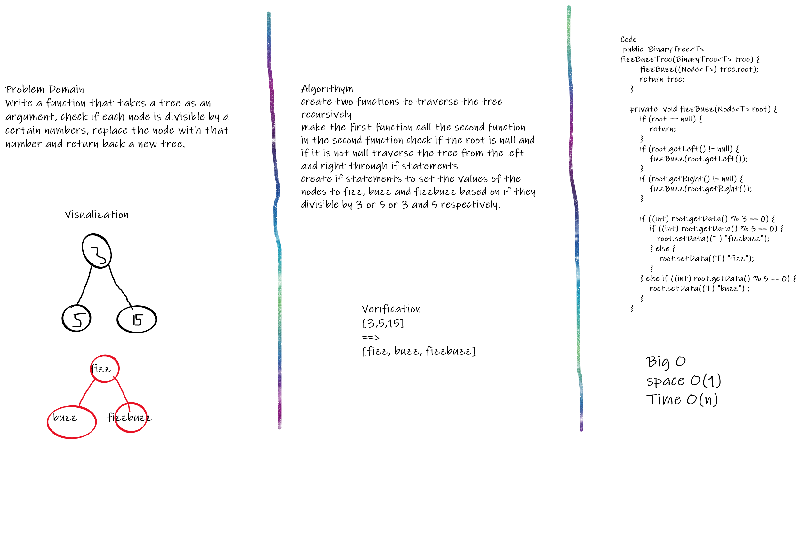

# Code challenge 18
# Challenge Summary
This challenge was about creating a function that takes a tree as an argument, check if each node is divisible by a certain numbers, replace the node with that number and return back a new tree.

## Whiteboard Process

## Approach & Efficiency
I used recursion to call a function multiple times and traverse through the tree and replace values based on the specified conditions. 

## Solution

[3,5,15]
==>
[fizz, buzz, fizzbuzz]

