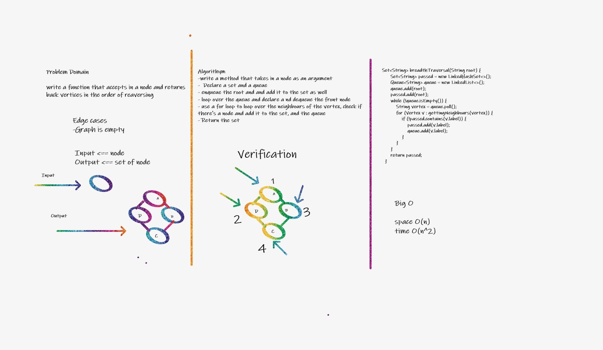
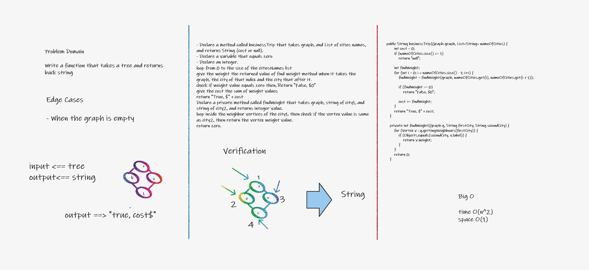
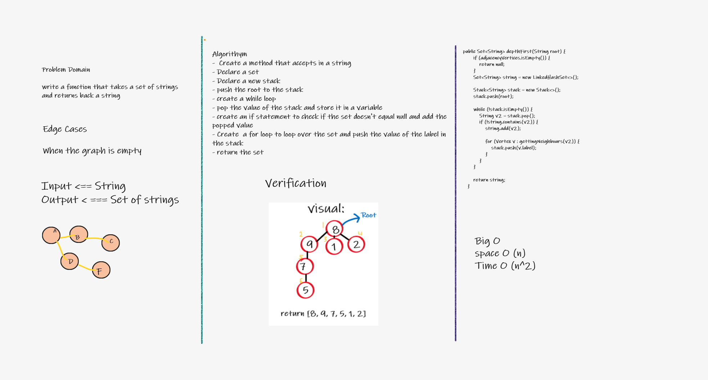

# Graphs

Graphs are a data structure that has nodes called vertices and relations called edges.

## Challenge

This challenge was to add nodes, get nodes and get edges to a graph

## Approach & Efficiency

addding nodes and edges

Time: O(1)
Space: O(1)

Getting nodes and edges
Time: O(n)
Space: O(n)

## API

- Adding a node: This method adds a vertex to the graph.

- Adding an edge: This method adds a new edge between two Vertices in the graph.

- Getting nodes: This method returns all of the nodes in the graph.
- Getting Neighbours: This method returns the relations of some required vertices and returns a list.

# 36 Breadth Traversal

This challenge was to write a function that accepts in a node and returns back vertices in the order of reaversing

## Whiteboard Process

## Approach & Efficiency

-write a method that takes in a node as an argument

- Declare a set and a queue
- enqueue the root and and add it to the set as well
- loop over the queue and declare a nd dequeue the front node
- use a for loop to loop over the neighbours of the vertex, check if there's a node and add it to the set, and the queue
- Return the set

# 37 Business Trip

This challenge was to write a function that accepts in a node and returns back vertices in the order of traversing

## Whiteboard Process

## Approach & Efficiency

# 38 Graph Depth first

This challenge was to write a function that takes a set of strings and returns back a string

## Whiteboard Process

## Approach & Efficiency

- Create a method that accepts in a string
- Declare a set
- Declare a new stack
- push the root to the stack
- create a while loop
- pop the value of the stack and store it in a variable
- create an if statement to check if the set doesn't equal null and add the popped value
- Create a for loop to loop over the set and push the value of the label in the stack
- return the set
