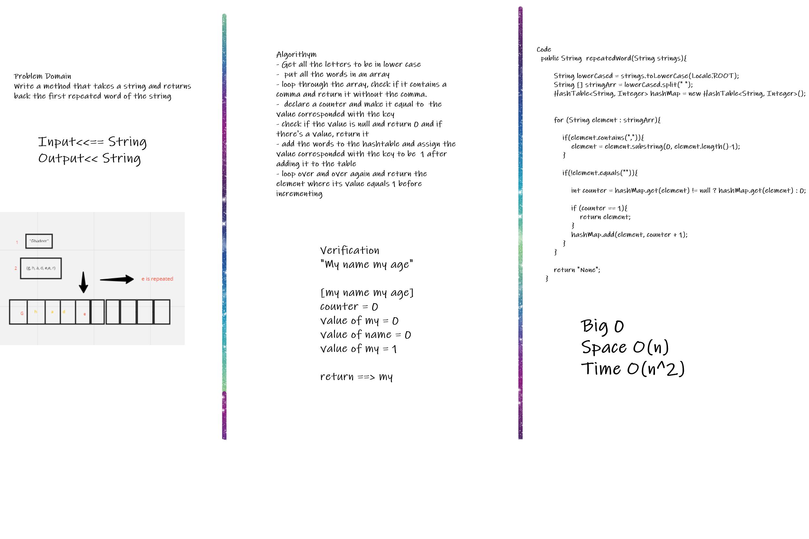
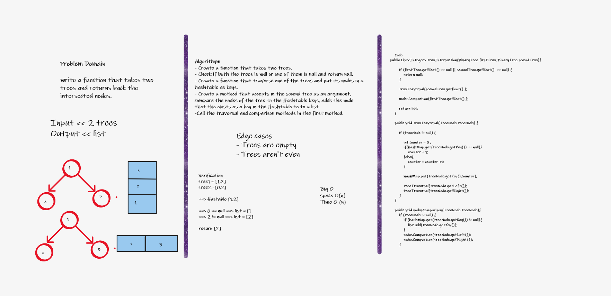
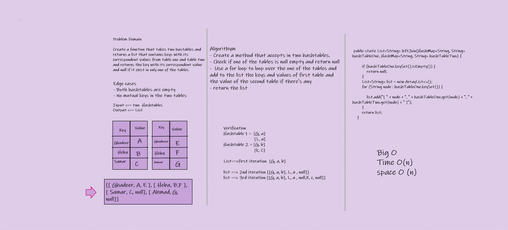

# Hashtables

## Challenge 30
This challenge was to create a hashtable, add nodes to it, check if it contains specific things.

## Approach & Efficiency
We used while and for loops and created treeNode class and and hashtable class.

# Challenge 31
This challenge was to Write a method that takes a string and returns back the first repeated word of the string

## Whiteboard Process

## Approach & Efficiency
#### Get all the letters to be in lower case
-  * put all the words in an array 
- *  loop through the array, check if it contains a comma and return it without the comma. 
-  * declare a counter and make it equal to  the value corresponded with the key
- * check if the value is null and return 0 and if there's a value, return it
- * add the words to the hashtable and assign the value corresponded with the key to be  1 after adding it to the table
- * loop over and over again and return the element where its value equals 1 before incrementing

## Solution
[my name my age]
counter = 0
value of my = 0
value of name = 0
value of my = 1

return ==> my

# Challenge 32
This challenge was to write a function that takes two trees and returns back the intersected nodes.
## Whiteboard Process

## Approach & Efficiency

* Create a function that takes two trees.
*  Check if both the trees is null or one of them is null and return null.
* Create a function that traverse one of the trees and put its nodes in a hashtable as keys.
* Create a method that accepts in the second tree as an argument, compare the nodes of the tree to the Hashtable keys, adds the node that the exists as a key in the Hashtable to to a list
* Call the traversal and comparison methods in the first method.
## Solution
tree1 = [1,2]
tree2 =[0,2]

==> Hastable [1,2]

==> 0 == null ==> list = []
==> 2 != null ==> list = [2]

return [2]

# Challenge 33
This challenge was to write  a function that takes two hastables and returns a list that contains keys with its correspondent values from table one and table two and returns the key with its correspondent value and null if it exist in only one of the tables## Whiteboard Process

## Approach & Efficiency Create a method that accepts in two hashtables.
* Check if one of the tables is null empty and return null
-  Use a for loop to loop over the one of the tables and add to the list the keys and values of first table and the value of the second table if there's any
- return the list

Big O
Time O(n), 
space O (n)

## Solution
Hashtable 1 =  [G, a]
                        [L, a]
Hashtable 2 = [G, b]
                        [k, C]

List==>first iteration  [G, a, b]

list ==> 2nd iteration [[G, a, b], L, a , null]]
list ==> 3rd iteration [[G, a, b], L, a , null,K, c, null]]

