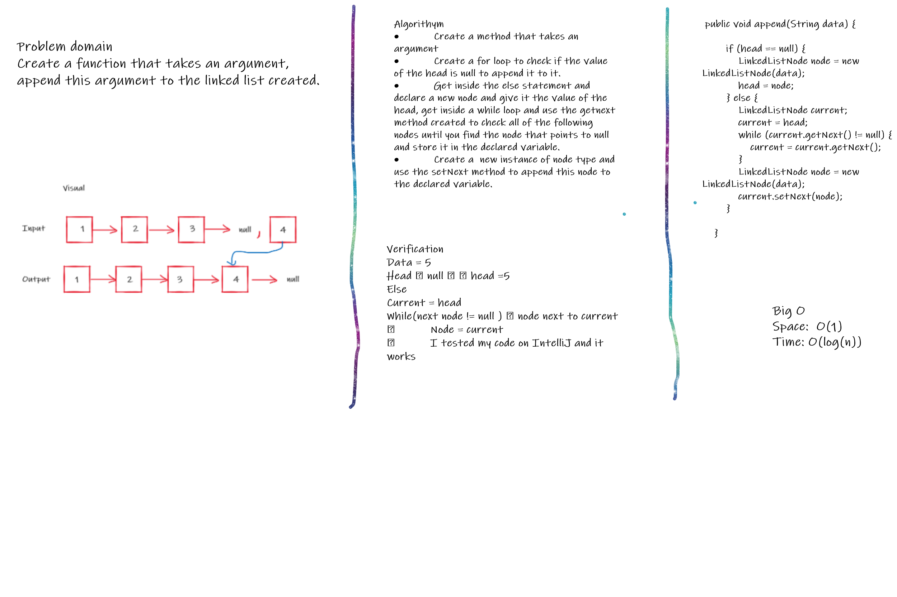
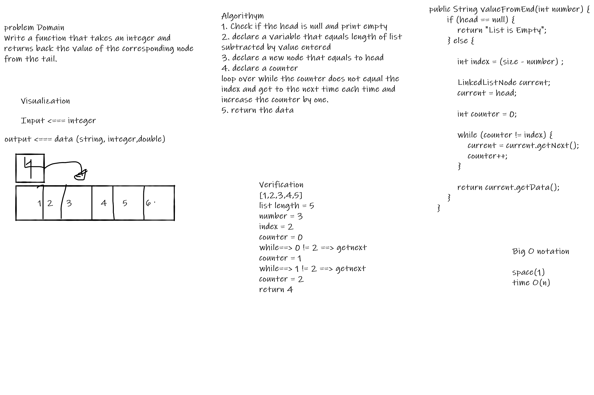
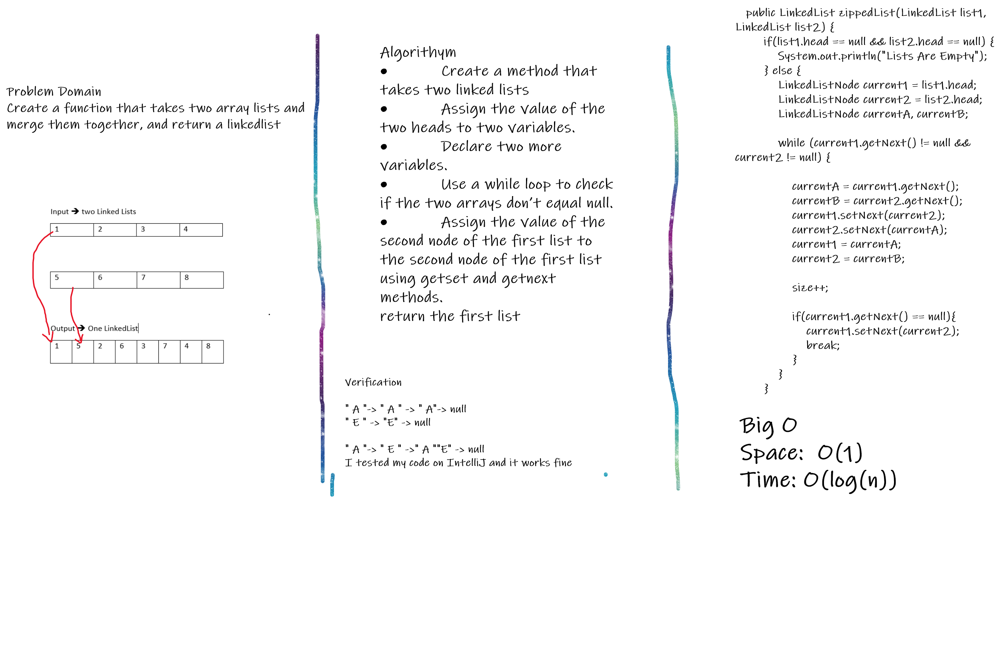
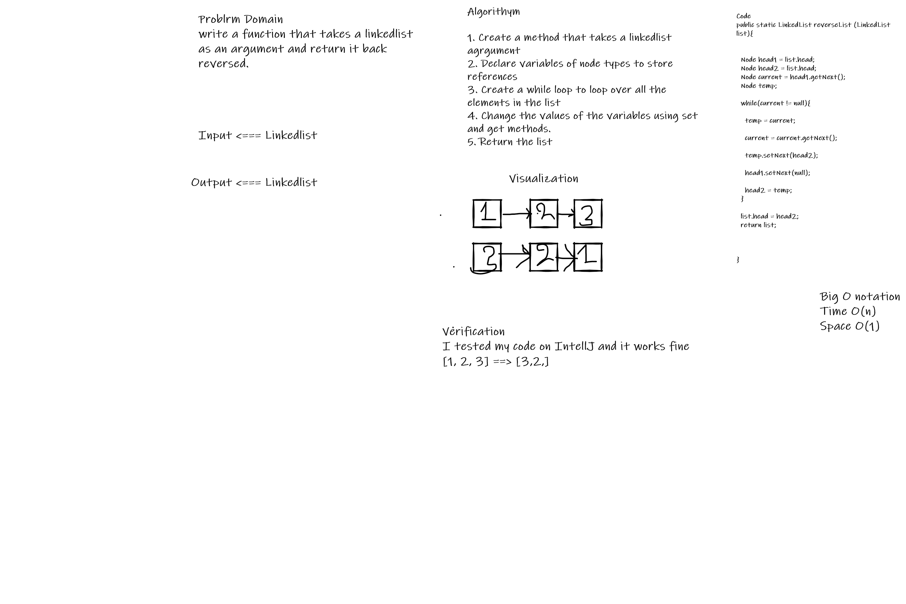

6. 
Challenge Summary
The challenge was to create three methods within the linkedlist class that we created, the first one to append a new value to the list, the second one to append a new value baefore a specific value that exisit in the list and the third one to append a new value to the list after a specific value.

Approach & Efficiency
I used for and while loops to check the value of the head at first and act accordingly, as the head is the only node that we can deal within our created list.
Big O Space: O(1) Time: O(log(n))

Solution
Data = 5 Head ==> null   head =5 Else Current = head While(next node != null )  node next to current ==> Node = current

7.kthvalue from the tail

This chellenge was about knowing what a specific value is based on some specific input.

Approach & Efficiency
I used a while loop and declared some variables and used get and set methods.

Solution
[1,2,3,4,5]
list length = 5 
number = 3
index = 2
counter = 0
while==> 0 != 2 ==> getnext
counter = 1
while==> 1 != 2 ==> getnext
counter = 2
return 4

Zipped List 

This challenge was two enter two lists and merge them together.

8.  

Approach & Efficiency
I used a while loop and declared some variables and used get and set methods.

Solution
" A "-> " A " -> " A"-> null
" E " -> "E" -> null

" A "-> " E " ->" A ""E" -> null

9. Reversed List

This challenge was to reverse some specific Linked list.

Approach & Efficiency

I used while loop and if statements and created methods as well as declared variables.

Solution

[1,2,3] ====> [3,2,1]

