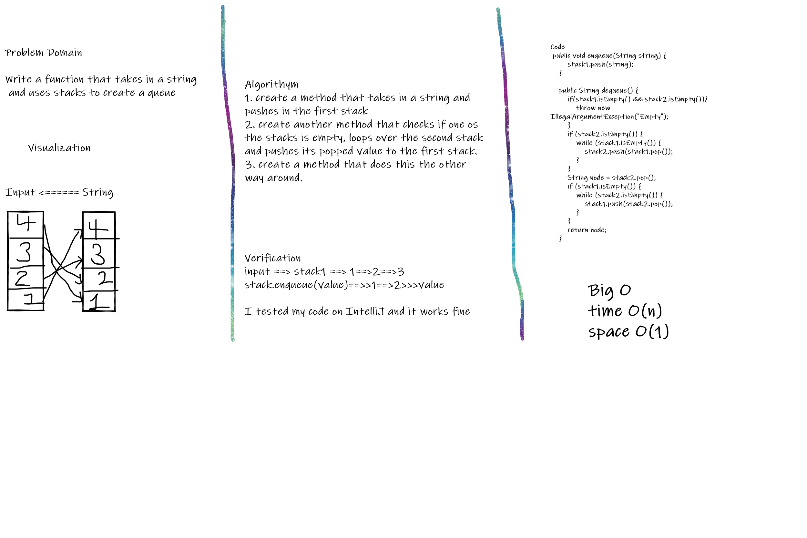
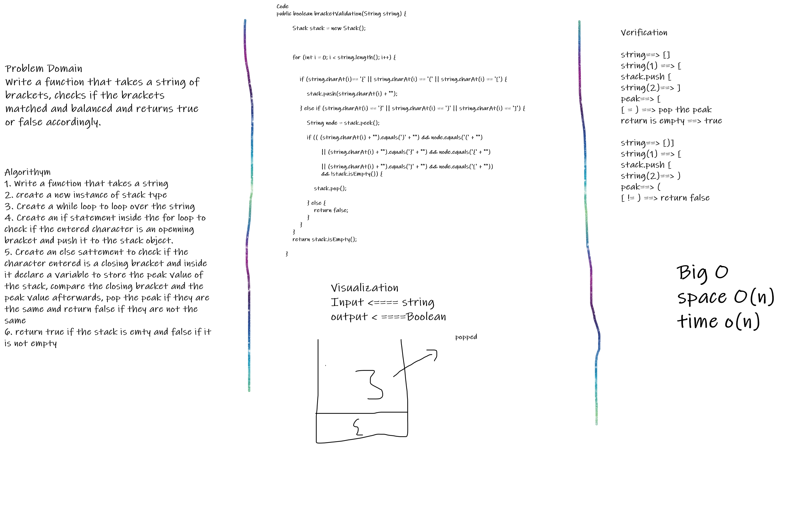

# Stacks and Queues

Stack are a placewhere you can save nodes above each other and pushing to the stack from the top only. Queues you can push from the rear and delete from thr front.

# Challenge 10. Stacks and Queues

This challenge was to create push, pop, peek methods for the stack and enqueue, dequeue and peek for queue.

## Approach & Efficiency

I used the methodology of the stacks and queues in creating corresponding methods and basically getnext and setnext methods.

## Stack

Stack

Push: pushed to the stack
pop: removes the top node
peek: get the top node

## Queue

Enqueue: adds a node from rear
Dequeue: Removes node from front
Peek: get the front node.

# Challenge 11. Implement a Queue using two Stacks.

# Challenge Summary

## Whiteboard Process

## Approach & Efficiency

I created two methods and used for and while loops and stacks methods such as push and pop.

## Solution

input ==> stack1 ==> 1==>2==>3
stack.enqueue(value)==>>1==>2>>>value

# Challenge 13. Multi-bracket Validation

# Challenge Summary

This challenge was about writing a function that takes a string of brackets, checks if the brackets matched and balanced and returns true or false accordingly.

## Whiteboard Process

## Approach & Efficiency

I used for loop, if statement and created methods(push and)

## Solution

Code process

string==> []
string(1) ==> [
stack.push [
string(2)==> ]
peak==> [
[ = ) ==> pop the peak
return is empty ==> true

string==> [)]
string(1) ==> [
stack.push [
string(2)==> )
peak==> (
[ != ) ==> return false
