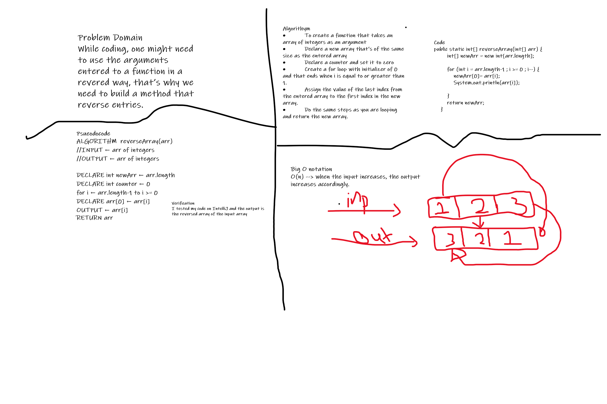

Reverse an Array
This challenge creates an a function to reverse an entered array

## Approach & Efficiency

I used a for loop and declared a new array based on the old array index. Big O notation, space o(1), time o(n).
