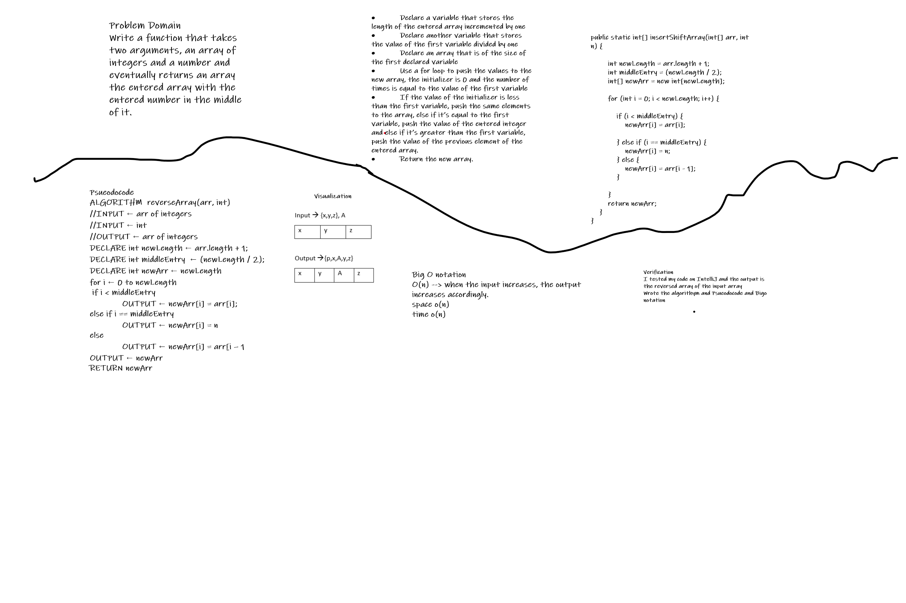

# Array insert Shift

This challenge creates an a function that adds an entered number to the middle of the entered array

## Approach & Efficiency

I used a for loop and if statements, declared a new array and pushed the required elements to the new array based on the conditions. Big O notation, space o(1), time o(n).
