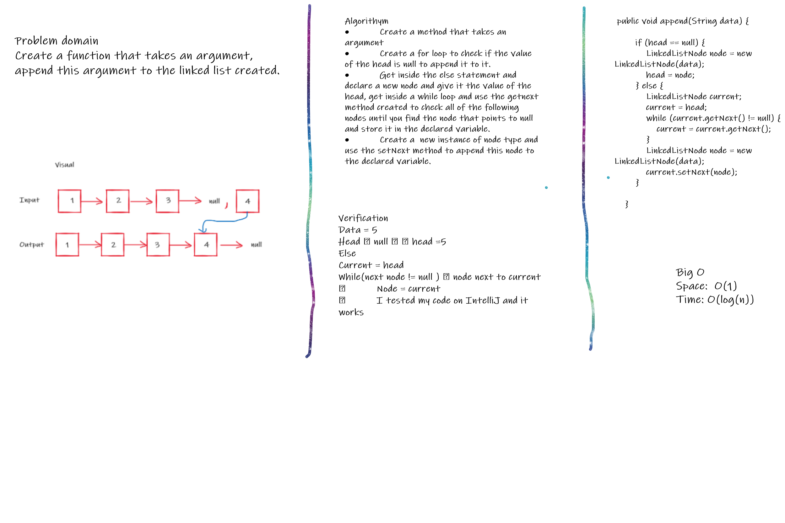
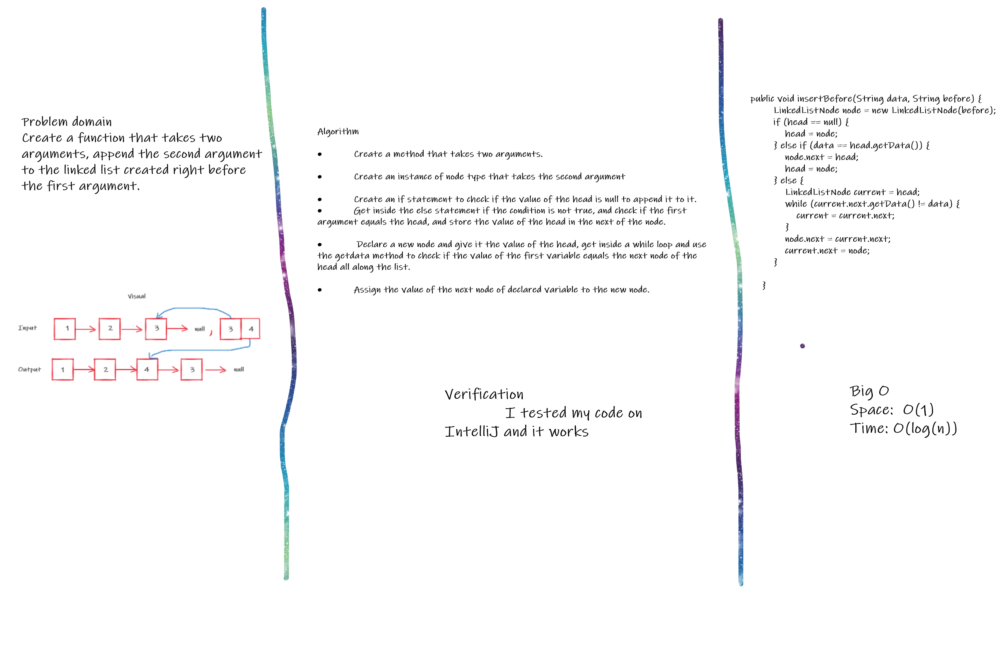
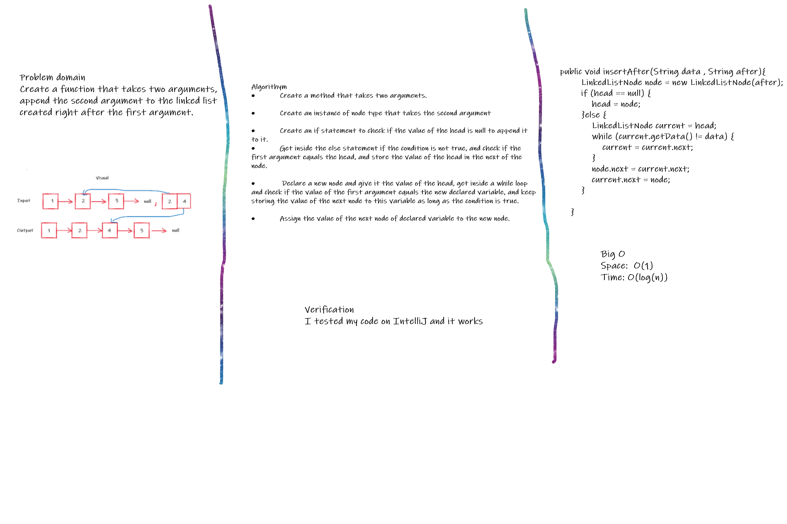

# Challenge Summary

The challenge was to create three methods within the linkedlist class that we created, the first one to append a new value to the list, the second one to append a new value baefore a specific value that exisit in the list and the third one to append a new value to the list after a specific value.

## Whiteboard Process

## Approach & Efficiency

I used for and while loops to check the value of the head at first and act accordingly, as the head is the only node that we can deal within our created list.

Big O
Space: O(1)
Time: O(log(n))

## Solution

Data = 5
Head ==> null   head =5
Else
Current = head
While(next node != null )  node next to current
==> Node = current
