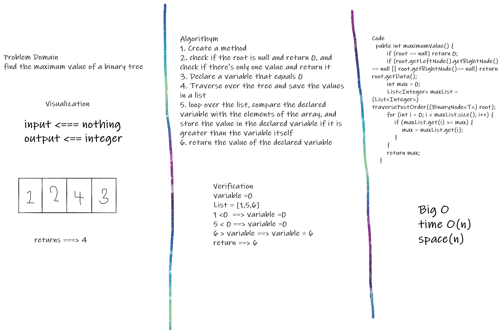
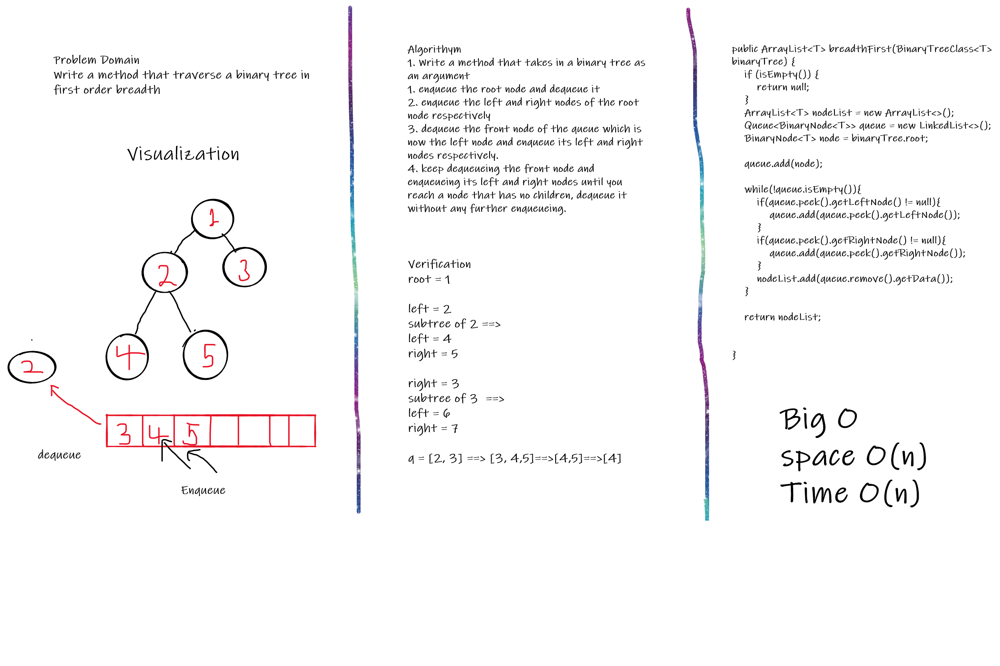

# Challenge 15 trees

This challenge was to traverse a binary search tree and create include and contains methods.

## Approach & Efficiency

I created a data and structure class and created the methods accordingly.

## Solution

I used inorder traversal, preorders traversal and post order traversal methods. Also created contains and includes methods.

# Challenge 16

This challenge was to to find the maximum value in a binary tree.

## Whiteboard Process

## Approach & Efficiency

I declared a new list and used a for loop and predefined method which is the post traversal.

Big O
time O(n)
space(n)

## Solution

variable =0
List = [1,5,6]
1 <0 ==> variable =0
5 < 0 ==> variable =0
6 > variable ==> variable = 6
return ==> 6

# Code challenge 17
# Challenge Summary
This code was to Write a method that traverse a binary tree in first order breadth.

## Whiteboard Process

## Approach & Efficiency
I used an arraylist and queue, while and if statements. 

## Solution
root = 1

left = 2
subtree of 2 ==>
left = 4
right = 5

right = 3
subtree of 3  ==>
left = 6
right = 7

q = [2, 3] ==> [3, 4,5]==>[4,5]==>[4]